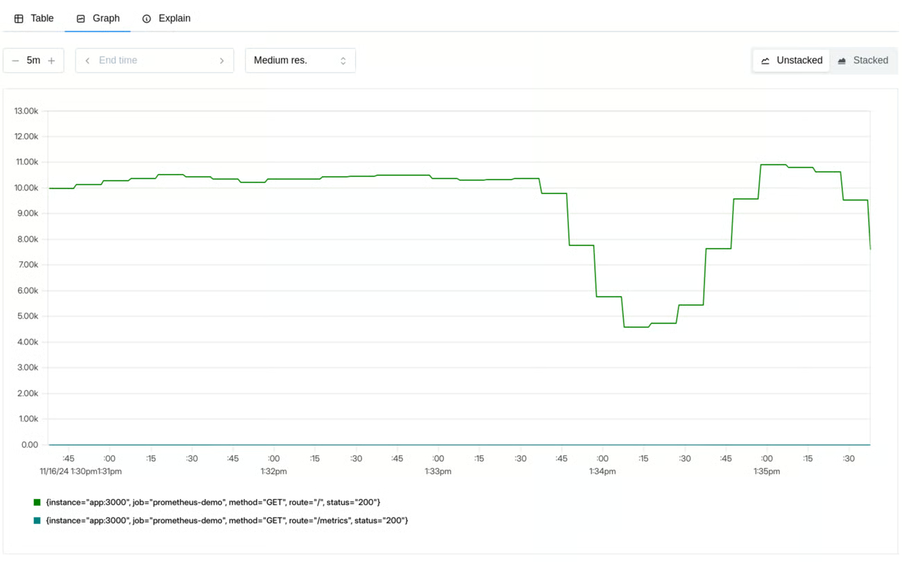
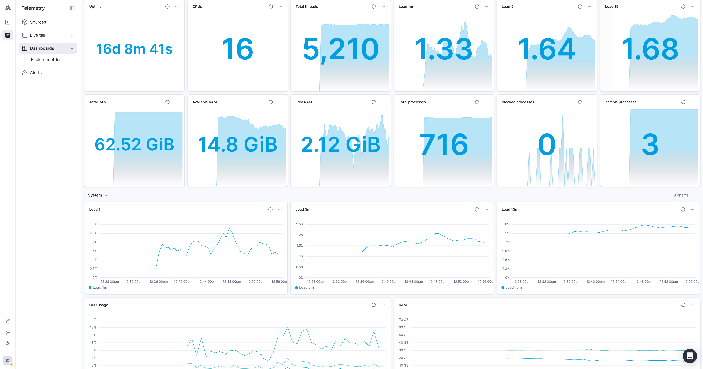

## Introduzione

> cosa, come, perch

__definizione__

- determinare responsivness, througput, reliability, scalability di un _sistema_ sotto un determinato workload
    - sistema == diversi componenti che devono interagire, non possiamo prendere solamente una parte isolata. a volte potrebbe semplicemente "risolvere" un problema spostando il blocco in un altro sistema

__perchè misuriamo?__

- le applicazioni non performanti generalmete non sono in grado di svolgere la funzione per cui erano state progettate/pensate

- passo aggiuntivo agli operational acceptance test. questi si fermano a dire se l'applicazine funziona oppure no

- cosa sono le performance? quando una applicazione è performante? Quando consente ad un utente di eseuguire un dato task senza _percepire_ delay o irritazione

- eserre certi di essere pronti alla release

- verificare adeguatezza dell'infrastruttura
    - abbiamo abbastanza risorse? il sistema rimane stabile?
    - valutare diverse modalità di deploy. siamo certi che quella configuraizone più costosa ne valga davvero la pena?

- circoscrivere le ottimizzazioni
    - non ha senso ottimizzare elementi che non incidono realmente sulle metriche di interesse

__Cosa possiamo misurare?__
- avaiability
- response time
- througput
- utilization
- scalability

__Perché i problemi di performance esistono?__

- più tardi il problema di performance emerge, maggiore è il costo per risolverlo -> come molti altri problemi! anche in questo caso è necessario uno shift-left nella risoluzione del problema, così come accade per la security o altro

- ma perché non si eseguono questi test __prima__?
    - problemi culturali
    - scarsa utilità percepita
    - brutta developer experience? strumenti complessi, difficili da configurare?

__quali attività comprende?__

1. identficare l'ambiente di test: con cosa dobbiamo lavorare?
2. determinare gli acceptance criteria: come faccamo a sapere che abbiamo fatto bene?
3. pianificare i test: quali sono gli scenari? assomigliano all'uso reale del prodotto? non ha senso eseguire test simulando milioni di utenti se abbiamo centinaia i utenti
4. setup ambiente
5.  implementazione dei test
6. esecuzione
7. analisi dei test

__Contesto di progetto__

di che cosa dobbiamo tenere conto quando definiamo dei test sulle performance? più che in altre tipologie di test il risultato non è bianco/nero ma deve essere inerpretato e il perimetro delineato. senza defnire il contesto del progetto è estremamene facile focalizzarsi su aree errate di analisi

- project vsion: la vision del progetto definisce il suo scopo ultimo, il suo stato desiderato futuro e consente di allineare le decisioni strategiche degli stakeholder

- scopo del sistema: se non sappiamo l'intento del sistema certamen non possiamo neanche ipotizzare le aree su cui mettere il focus

- aspettative degli utenti: mettersi nei panni degli utenti. la loro felicità non rispecchia per forza di cose dei requisiti scritti su un foglio da un manager

- obiettivi di business: come per ogni altro progetto, tenere rispettare tempi e budget

- motivo per cui vengono eseguiti i test: possono variare durante le fasi di sviluppo, importante sapre rimetterli in discussione

- valore che i test portano al progetto: sapere mappare i requisiti di business in appropriati test e determianre il valore che portano

- gestione di progetto: 

- processi:

- criteri di compliance

- schedule del progetto

__tipologia di test__

- performance: determinare valocità, scalabilità, stabilità di un sistema. importante capire tempi di risposta, througput, e utilizzo di risorse

- load: simulare un elevato carico sul sistema per vedere come si comporta rimanendo comunque nei limiti progettuali (sitme iniziali sull'utilizzo)

- stress testing: andre anche oltre alle condizioni progettuali. determinare cosa succede con poca memoria, paizo insufficiente, failure di server. L'importante è capire come e perché il sistema schiatta

__definizione di baseline__

definire una baseline significa determinare le condizioni "as-is" del sistema in modo da  o identificre regressioni futurepotere avere un confronto per i nostir miglioramenti

__risks addressed throug performance testing__

- processo fondamentale per mitigare determinati rischi di business e identificare aree di interese per quanto riguarda usabilità, funzionalità, sisicurezza che non è possibile ottenere in altro modo

- speed related risk: legata ma non limitata alla soddisfazione degli utenti finali. altri esempi possono includere ad esmepio il consumo di dati e produzione di output entro un certo lasso di tempo o prima che i dati diventino obsoleti
    - cercare di replicare per quanto possibile condizioni operative reali, ad esemio come si comporta il mio sistema se il carico avviene durante un aggiornamento o durante un backup?

- scalability related risk: non solo legato al numero di utenti ma anche al variare di volume di dati processati.
    - l'applicazioen rimane stabile per tutti gli utenti?
    - l'applicazione è in grado di raccogliere tutti i dati del suo ciclo di vita?
    - abbiamo modo di renderci conto se stiamo arrivando a capacity?
    - funzionalità e  sicurezza vengono compromesse con un elevato carico?
    - siamo in grado di gestire picchi nonpreviste?

## Tassonomia dei test

------

## I Pilastri della misurazione: Metodologia e Segnali Chiave

> bene, ho capito che è importante! cosa posso fare? 

### Metodo RED

Il metodo RED (Rate, Errors, Duration) è un framework di monitoraggio orientato all'esperienza dell'utente e al comportamento dei servizi. È particolarmente efficace per i microservizi e le applicazioni guidate da richieste, fornendo una visione chiara di come il carico di lavoro viene gestito dal punto di vista del servizio.

Il metodo RED risponde alla domanda "Cosa sta andando storto dal punto di vista dell'utente?" ed è eccellente per impostare allarmi significativi e misurare gli SLA (Service Level Agreements).

#### Rate

> Quanto il nostro servizio viene usato?

Conteggia quante richieste il nostro sistema sta gestendo, nel caso di un web service potrebbero essere le richieste ricevute mentre per un database le query ricevute, per un gestore di code il numero di messaggi ricevuti etc...

Rappresentano le fondamenta per molte altre misurazioni consentendo, ad esempio, di mettere in relazione incrementi di errori con  un incremento del traffico oppure di contestualizzare meglio un calo di altre metriche

#### Errors

> Qaunte richiesta stanno fallendo?

Si intende in modo generico ogni richiesta che viene compeltata con un risultato diverso da quello atteso, indipendentemente dal motivo (errore esplicito, timeout, risultati errati)

Possbile misurare gli errori sia come percetuale di richieste che come numero di errori al secondo, in modo da avere una misura assoluta. 

#### Durations

> Quanto tempo impiegano le richieste?

Tipicamente misurato in secondi o millisecondi, consente di avere una stima delle performance dal punto di vista degli utenti.

Quando catturiamo questa tipologia di metriche, è importante ragionare in termini di distribuzione piuttosto che di media: problemi, anche gravi, che affligono un ristratto numero di richieste vengono facilmente nascosti dal computo di una media.

La rappresentazione tipica per questo tipo di misurazoini sono gli istogrammi raggruppati in percentili:
- 50-esimo percentile: rappresenta la mediana, ovvero l'esperienza di un utente tipico
- 90-esimo percentile: rappresenta l'esperienza del 10% più lento
- 99-esimo percentile: rappresenta l'esperienza dell'1% più lento

Ragionare per percentili consente di potere fare ragionamenti anche sofisticati:
- stiamo analizzando l'intera gamma di possibili esperienze utente,
- consente di prendere decisioni sulla definizione di SLO,
- rende più evidente il degrado delle performance dato che è immediatamente visibile nel 99-esimo percentile,
- segmentando per endpoint è possibile determinare le aree di intervento più interessanti

#### Spunti per le Dashboard

> Cosa deve consentire di fare una buona dashboard per queste metriche?

Duplice necessità: sia avere la visibilità complessiva in modo rapido che potere indagare più a fondo

Request rate: mostra il volume di traffico nel tempo, suddiviso per endpoint, metodo o altre dimensioni utili, per identificare andamenti anomali.

Errori: visualizza sia il numero assoluto che la percentuale di errori, con dettagli per tipo di errore ed endpoint coinvolti. Aggiungi alert se superano gli SLO.

Duration: mostra i percentili di latenza (p50, p90, p99) nel tempo, con suddivisione per endpoint, per individuare colli di bottiglia e migliorare le performance.

### Metodo USE

Mentre il metodo RED si concentra sulla prospettiva del servizio e dell'utente, il [metodo USE](https://www.brendangregg.com/usemethod.html) (Utilization, Saturation, Errors) si concentra sulle risorse infrastrutturali sottostanti. Ideato da Brendan Gregg, è un approccio semplice ma potente per analizzare le prestazioni di qualsiasi sistema, aiutando a identificare rapidamente i colli di bottiglia delle risorse o gli errori.

Usa un approccio molto semplice ed empirico che può essere sintetizzato come: 
> For every resource, check utilization, saturation, and errors.

Il suo scopo è consentire di identificare in modo rapido i bottole neck del sistema e si basa su alcune definizione di base:

- risorse: le risorse del sistema, siano essere hardware, softwareo o limiti imposti
- utilizzo: tempo medio per cui le risorse sono impegnate,
- saturazione: grado per cui le risorse sono sono in grado di gestire il carico 
- errori: conteggio degli eventi di errore

#### Risorse

> Quali sono i componenti del sistema? come comunicano tra di loro?

Per prima cosa occorre determinare quali sono le risorse che compongono il nostro sistema. In questa fase è estremamente utile consulare, o redarre, diagrammi che evidenziano i flussi di comunicazione.
Avere idea di come le componenti interagiscono è estremamente utile per individuare colli di bottiglia, reali o sospetti.

#### Utilization

> Quanto sono impegnate le risorse?

Utilization (Utilizzo): Misura la percentuale di tempo in cui una risorsa è occupata. Ad esempio, l'utilizzo della CPU, della memoria, del disco o della rete. Un utilizzo elevato (vicino al 100%) può indicare che la risorsa sta diventando un collo di bottiglia.

Un utilizzo vicino al 100% è quasi sempre un segno di bottleneck, in questo caso può essere molto utile verificare la presenza di saturazione.
Anche valori alti (eg: 70%) possono essere problematici:
- se stiamo usando valori aggregati potrbbero nascondere burst anche peggiori
- alcune risorse, come ad esempio i dischi, non possono essere interrotti duante una operazione anche se una seconda operazione ha priorità maggiore. Avere un alto utilizzo di risorse potrebbe comportare l'accordarsi di task con priorità maggiore

#### Saturation

> Quanto lavoro non posso gestire in questo momento?

Saturation (Saturazione): Indica il grado di lavoro aggiuntivo, non gestito, che una risorsa deve affrontare. Spesso si manifesta come lunghezze di coda o tempi di attesa. Un'elevata saturazione significa che la risorsa non riesce a tenere il passo con la domanda, anche se il suo utilizzo non è al 100%.
In questo caso, ogni valore diverso da zero rappresenta un problema

Se l'utilization misura quanto una risorsa è occupata, adesso stiamo misurando quanti problemi stiamo accusando.

Alcune metriche chiave possono essere:

- carico medio CPU 
- uso della memoria SWAP
- coda I/O dei dischi
- lunghezza della Thread pool queue 

#### Errors

> Quanto si sta rompendo?

Errors (Errori): In questo contesto, si riferiscono agli errori a livello di risorsa, come errori di I/O del disco, errori di rete o errori hardware. Questi errori possono indicare problemi che potrebbero non manifestarsi immediatamente come errori dell'applicazione, ma che ne compromettono la stabilità.

Metriche di erroe comprendono:
- errori di rete
- errori sul file system
- errori di I7O sui dischi

Molto importante poterle correlare con altre metriche, ad esempio mettendo in relazione errori di rete con il grado di utilizzo della stessa.

#### Spunti per le Dashboard

> Cosa deve consentire di fare una buona dashboard per queste metriche?

Un dashboard USE completo fornisce visibilità sulla salute e capacità delle risorse infrastrutturali

Utilizzazione: mostra la percentuale d’uso nel tempo di CPU, memoria, spazio disco e banda di rete, per valutare il carico e prevedere colli di bottiglia.

Saturazione: evidenzia situazioni di sovraccarico con metriche come load average CPU, uso dello swap, lunghezza delle code I/O su disco e rete.

Errori: mostra gli errori a livello risorsa nel tempo, come fallimenti di allocazione memoria, errori di rete, errori I/O su disco, per intercettare problemi hardware o sistemici prima che diventino critici.

---

## L'Integrazione Strategica delle Metriche RED e USE: Un Approccio Sistemico al Performance Monitoring

La vera forza si manifesta quando i metodi RED e USE vengono utilizzati insieme. Sono complementari: i metriche RED ti dicono quando qualcosa non va dal punto di vista dell'utente, mentre i metriche USE ti aiutano a capire perché sta succedendo a livello infrastrutturale. Questa dualità offre una comprensione completa del comportamento del sistema, coprendo sia le interazioni dell'utente che le reazioni delle risorse.

Iniziate implementando il monitoraggio RED per avere una visione immediata delle prestazioni percepite dall'utente e, quando identificate un problema, usate il metodo USE per approfondire e individuare la causa principale a livello di risorsa.

Adottare queste metodologie nel vostro performance testing e nelle vostre strategie di monitoraggio vi permetterà di costruire sistemi più robusti, scalabili e performanti.
